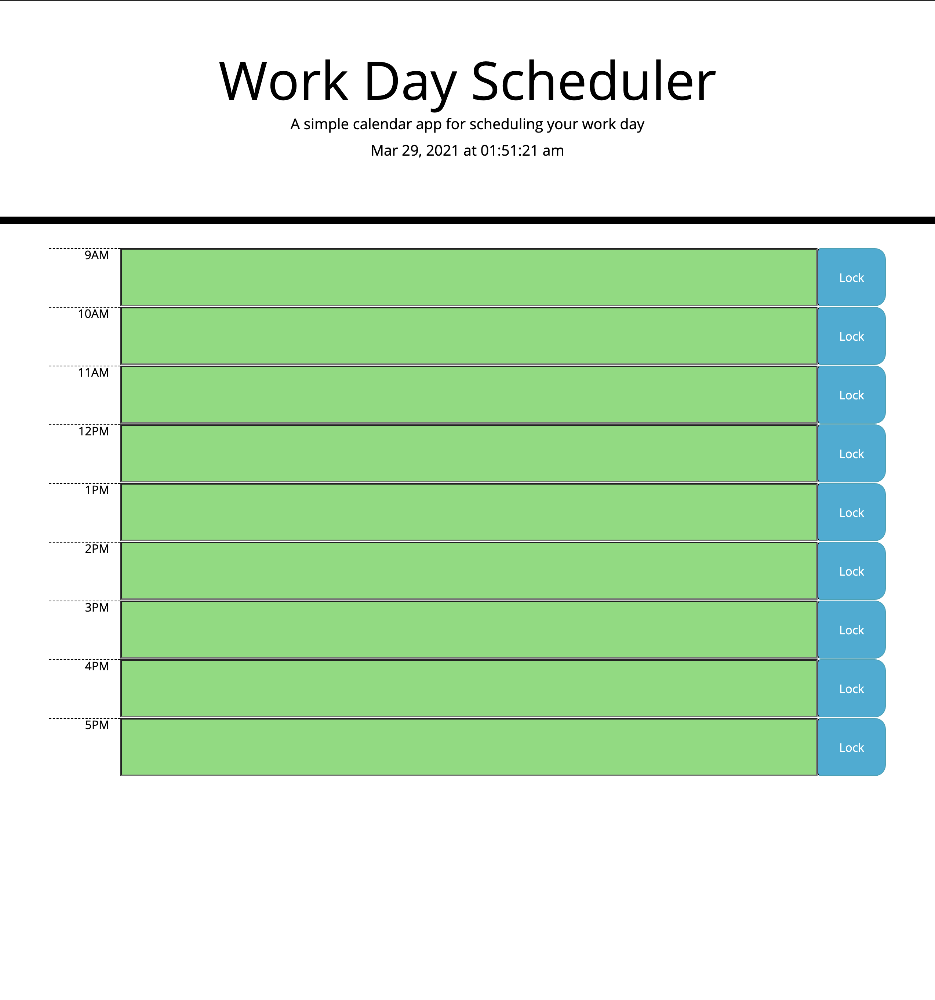
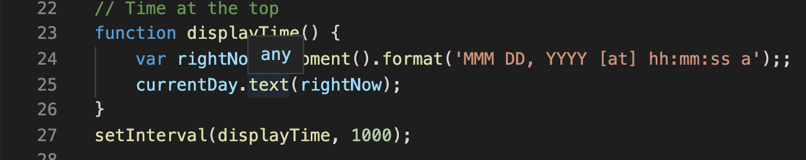
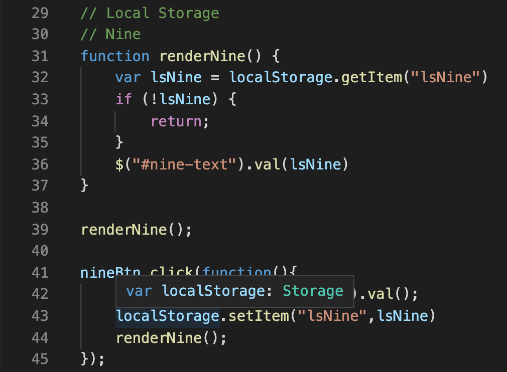
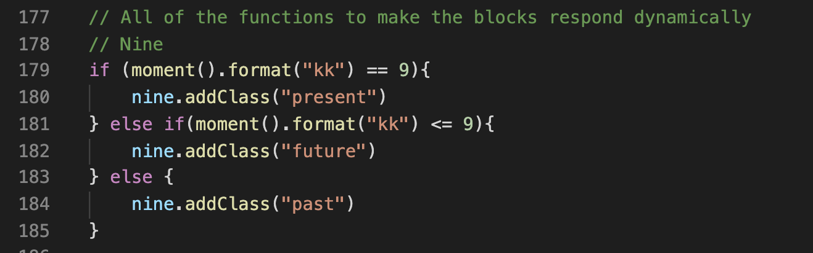

# Work Day Scheduler

## Intro

Wanting to plan out your busy schedule?

Then we've got you covered!

## Purpose

This website will allow you to set events on your schedule, see where you are in the, display the current time, and color each block a different color to inform you of whether it is a future, past, or present event.

## The Code Magic

Using moment.js the timer at the top of the page refreshes once every thousand milliseconds(every second).

Local storage is used to set the user's event in the calender and stay past a refresh. 

Lastly, the current time is checked and each block responds accordingly whether they are in the present, past, or future.

## Contributors

Chance V. Robinson

## License
N/A